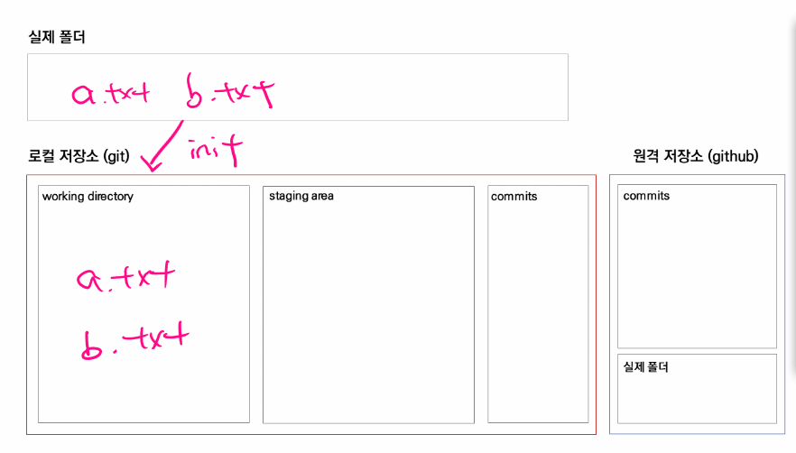
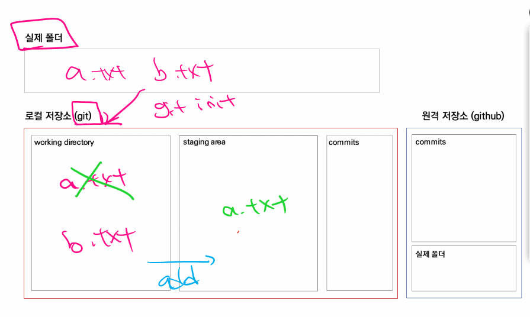
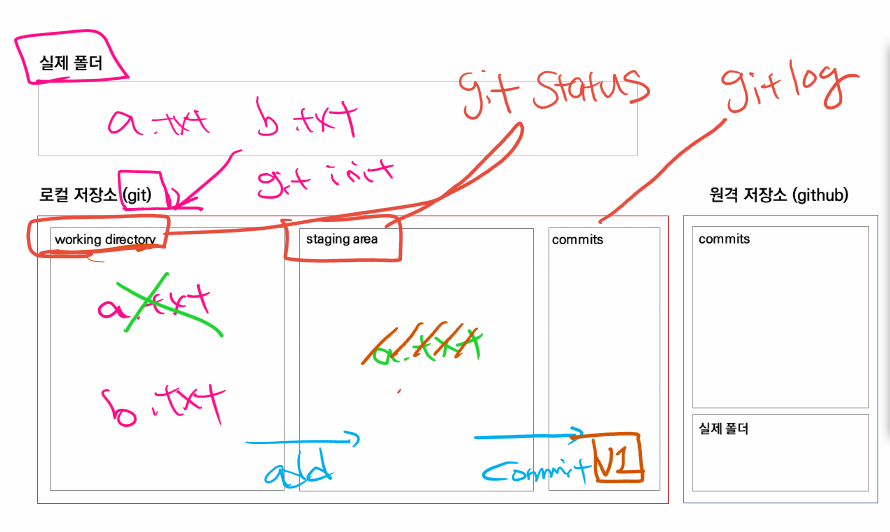

## 1. Git 초기 설정

**커밋 작성자(author) 설정**

- 최초 1회 설정
- 만약 설정을 하지 않고 진행하면 commit 메시지를 남기는 상황에서 아래와 같은 에러 발생

```bash
$ git commit -m "Initial commit"
Author identity unknown # 이거 누가 쓴지 모르겠음 

*** Please tell me who you are. # 님이 누군지 좀 알려줘..!

Run # 아래 이거 그냥 따라하셈
 
  git config --global user.email "you@example.com"
  git config --global user.name "Your Name"

to set your account's default identity.
Omit --global to set the identity only in this repository.

fatal: unable to auto-detect email address (got 'campusseven05@DESKTOP-30KI4HL.(none)')
```


- 이 설정은 인증(로그인) 정보와는 전혀 상관없음

```bash
# author 설정
$ git config --global user.email "edujustin.hphk@gmail.com"
$ git config --global user.name "edujustin"

# 설정 확인
$ git config --global --list # -l(소문자)
user.email=edujustin.hphk@gmail.com
user.name=edujustin
```


**(추가 설정) 커밋 편집기 변경** 

- 해당 명령어는 반드시 vscode가 설치되어 있어야 함 

- 기본 텍스트 편집기를 `vim`에서 `vscode` 로 변경하는 것 

```bash
$ git config --global core.editor "code --wait"
```


## 2. Git Basic

### 로컬 저장소 설정

```bash
# git 초기화 -> master 표시가 뜰 것!
# 결과적으로 해당 폴더에 숨기 폴더로 .git/이라는 폴더가 생김
$ git init
Initialized empty Git repository in C:/Users/campusseven05/Desktop/practice/.git/

# 확인
$ ls -a
./  ../  .git/
```


> 주의 사항!!
>
> `.git` 폴더가 또 다른 폴더 내부에 있으면 안됨! (git 속 git은 절대 금지!!!)





### status

> 현재 git이 관리하는 폴더의 파일과 폴더 상태를 알려주는 명령어(working directory & staging area를 확인하는 명령어)

```bash
$ git status # WD & SA를 확인하는 명령어!! 정말 정말 중요하기 때문에 습관적으로 사용해야합니다.
On branch master

No commits yet

Untracked files:
  (use "git add <file>..." to include in what will be committed)
        a.txt
        b.txt

nothing added to commit but untracked files present (use "git add" to track)
```


### add

> WD -> SA로 올리는 과정 

```bash
$ git add a.txt

$ git status
On branch master

No commits yet

Changes to be committed: # 커밋 되어질 변경 사항들 
  (use "git rm --cached <file>..." to unstage)
        new file:   a.txt

Untracked files: # git이 아직 변경 사항을 추적하고 있지 않은 친구들
  (use "git add <file>..." to include in what will be committed)
        b.txt
```




```bash
# 기본 -> commit을 위한 폴더 & 파일을 추가!
$ git add 파일/폴더이름

$ git add a.txt # 특정 파일을 WD -> SA 
$ git add . # 해당 디렉토리(하위 디렉토리 모두 포함)의 모든 폴더 & 파일을 SA 
$ git add my-folder/ # 특정 디렉토리를 WD -> SA
```


## commit

- commit을 통해서 하나의 버전으로 기록됨 
- commit 메시지는 현재의 변경 사항을 잘 나타내도록 '잘' 써야함
- commit 내역은 `$ git log`라는 명령어로 확인할 수 있음

```bash
# commit 메시지의 기본 구조 
# -m(message)
$ git commit -m "남기고 싶은 메시지"
```


```bash
$ git commit -m "Initial commit"
[master (root-commit) 00ebb6a] Initial commit
 1 file changed, 0 insertions(+), 0 deletions(-)
 create mode 100644 a.txt

# commit 내역 확인
$ git log
commit 00ebb6a458268bbea85ca4bba22326d0f0c4a76a (HEAD -> master)
Author: edujustin <edujustin.hphk@gmail.com>
Date:   Mon Jul 5 15:25:30 2021 +0900

    Initial commit
    
# commit 이력을 더 짧게 보기 
$ git log --oneline
00ebb6a (HEAD -> master) Initial commit
```


퀴즈! 만약 status를 여기서 찍으면 어떤 결과가 나올까?

- 현재 `b.txt`가 WD에 위치해있기 때문에 빨간색으로 표시된다.
- `a.txt` 는 commit 명령어를 통해 하나의 버전으로 기록됨

```bash
$ git status
On branch master
Untracked files:
  (use "git add <file>..." to include in what will be committed)
        b.txt

nothing added to commit but untracked files present (use "git add" to track)
```




