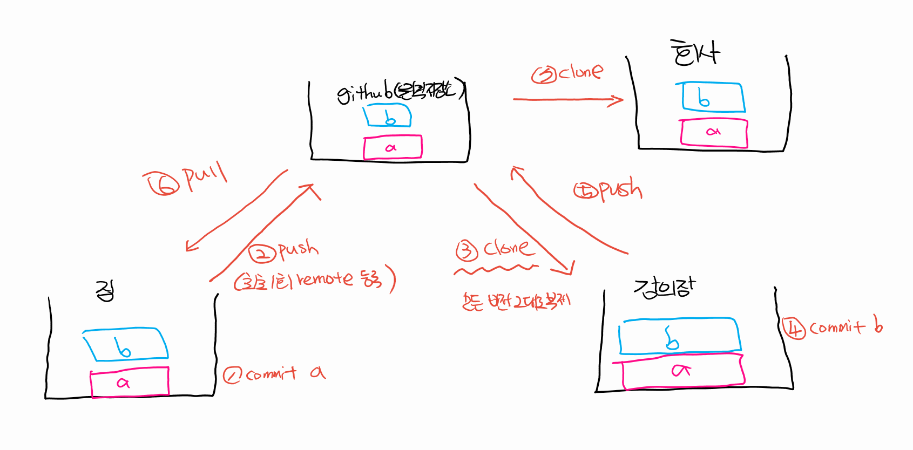

# push & pull & clone 


## push

- 로컬 저장소에서 관리한 버전 이력을 원격 저장소(github)으로 업로드 하는 명령어

```bash
$ git push origin master
```


- 참고

  ```bash
  $ git push -u origin master # 이건 한번만 붙이면 됩니다. (최소 1회 push 할 때만 붙이자!)
  ```

  


## pull

- 원격 저장소의 변경 사항을 받아옴(업데이트)
- commit 내역을 기반으로 변경 사항을 새로 갱신하는 행위 

```bash
$ git pull origin master # git아 pull(업데이트 해줘) origin 이라는 원격 저장소로부터 master 브랜치를!
```


```bash
$ git pull origin master
remote: Enumerating objects: 5, done.
remote: Counting objects: 100% (5/5), done.
remote: Compressing objects: 100% (3/3), done.
remote: Total 3 (delta 2), reused 0 (delta 0), pack-reused 0
Unpacking objects: 100% (3/3), 754 bytes | 62.00 KiB/s, done.
From https://github.com/edujustin-hphk/TIL
 * branch            master     -> FETCH_HEAD
   318fe37..b26517d  master     -> origin/master
Updating 318fe37..b26517d
Fast-forward
 99_markdown_syntax.md | 1 +
 1 file changed, 1 insertion(+)
```


## clone

- 원격 저장소 전체를 복제
- 최초 1회만 수행 

- 클론 받은 프로젝트는 자동으로 `.git`이 설정되어 있음 (+ `remote`도 등록되어 있음)
  - 복제한거니까!

```bash
$ git clone 복제할저장소URL
```


## push & pull(+clone)  시나리오

> 최초 1회 clone 이후 add, commit, push & pull, add, commit, push 

