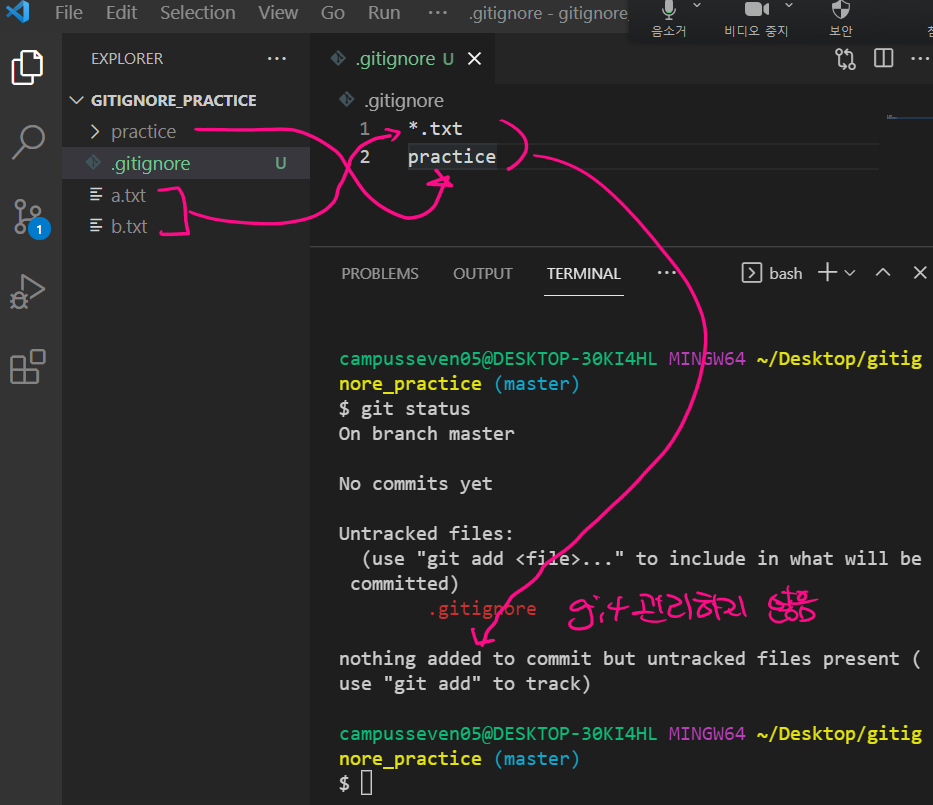

# gitignore

> git이 어떠한 폴더 / 파일의 버전 관리를 무시할 수 있도록 적어두는 문서 -> 여기에 적힌 내용은 git이 버전 관리를 하지 않습니다.

- 일반적으로 개인정보 및 특정 사람에게만 적용되는 개발 환경과 같은 설정이 포함됨
  - 개발할 때 사용하는 secret key, (보안상의 이유로) github과 같은 원격저장소에 업로드되면 안되는 정보 등은 git이 버전 관리를 하면 안됨
- 그리고 버전 관리가 필요없다고 생각되는 폴더 혹은 파일도 포함 시킬 수 있음 
- `.gitignore` 파일을 만들어서 관리한다. 
- 일반적으로  `git init` 을 진행하기 전에 만든다.


```bash
practice # 특정한 폴더를 git이 관리하지 않게함
a.txt # 특정한 파일을 git이 관리하지 않게함
*.txt # 특정한 확장자를 가진 파일을 git이 관리하지 않게함
```





## gitignore.io

https://gitignore.io/

- `.vscode` / `.DS_Store`  -> 보안상의 이유가 아니더라도 버전 관리의 필요성이 없는 친구들이 존재..! 

- 미리 특정한 언어, 프레임워크, 운영 체제 등에서 git으로 버전 관리를 할 필요가 없는 요소를 누군가! 미리 만들어 놓았음 
- 언어, 프레임워크, 운영체제 등을 검색하고 '생성' 버튼을 누르면 자동으로 필요한 내용을 만들어 준다.


## 퀴즈!

- gitignore는 어느 시점에 만드는 것이 좋을까요?	
  - git init 전/후
- gitignore 파일이 위치하는 곳은 어디일까요?
  -  일반적으로 `.git` 폴더가 존재하는 곳에 생성

