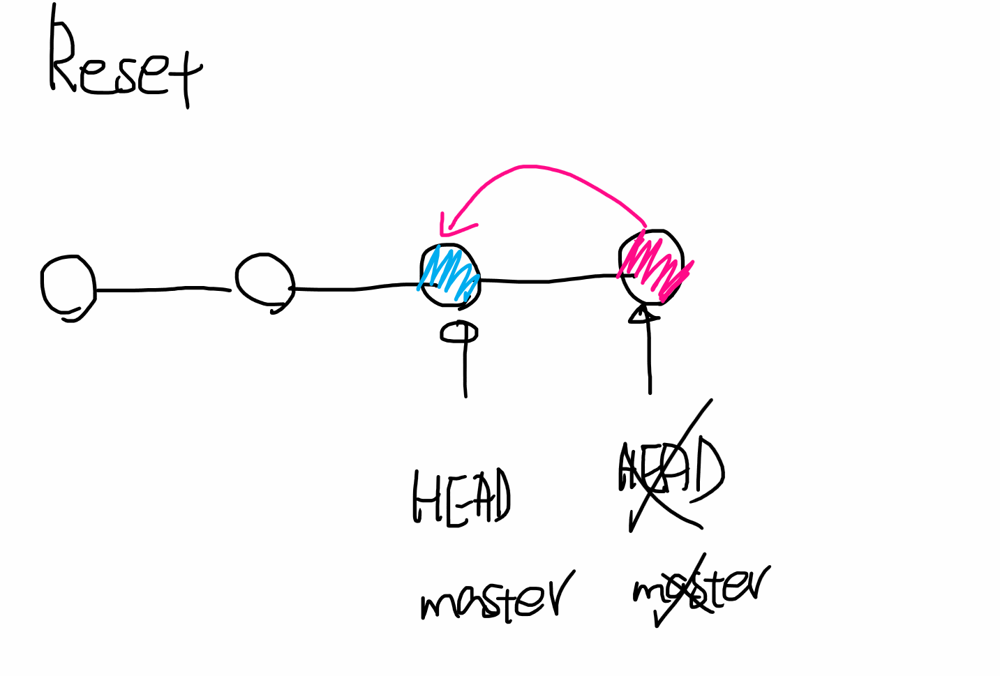

# reset vs revert

## reset

> https://git-scm.com/docs/git-reset
>
> **"시계를 마치 과거로 돌리는 듯한 행위"**
>
> 특정 커밋으로 되돌아가며 되돌아간 특정 커밋 이후의 커밋들은 모두 사라지며, 파일 상태는 옵션을 통해 결정


**3가지 옵션**

1. `--soft`

   reset하기 전까지 했던 SA, WD 작업은 남겨둠

   - **돌아가려는 커밋으로 되돌아가고,**

   - 이후의 commit된 파일들을 `staging area`로 돌려놓음 (commit 하기 전 상태)
   - 즉, 바로 다시 커밋할 수 있는 상태가 됨

2. `--mixed`

   (기본) SA reset, WD작업은 남겨둠

   - **돌아가려는 커밋으로 되돌아가고,**

   - 이후의 commit된 파일들을 `working directory`로 돌려놓음 (add 하기 전 상태)
   - 즉, unstaged 된 상태로 남아있음
   - 기본값

3. `--hard`

   reset하기 전 SA, WD 모든 작업 리셋

   - **돌아가려는 커밋으로 되돌아가고,**

   - 이후의 commit된 파일들(`tracked 파일들`)은 모두 working directory에서 삭제

   - 단, Untracked 파일은 Untracked로 남음



```bash
# undoing 폴더에서 했던 내용 이어서 진행

# --hard 예시
$ git log --oneline
3914910 (HEAD -> master) foo & bar
cdaa572 git commit amend test
ea0f746 first commit


$ git reset --hard cdaa572
HEAD is now at cdaa572 git commit amend test


$ git log --oneline
cdaa572 (HEAD -> master) git commit amend test
ea0f746 first commit

$ git status
On branch master
nothing to commit, working tree clean
```

- `reset`은 과거로 돌아가게 되면 돌아간 커밋 이후의 커밋은 모두 히스토리에서 사라짐
- **커밋 히스토리가 바뀌기 때문에** 다른 사람과  공유하는 브랜치에서 사용 시 충돌이 발생
- 공유하는 브랜치에서 이전 커밋을 수정하고 싶을 때는 `git revert` 사용


---


## revert

> https://git-scm.com/docs/git-revert
>
> **"특정 사건을 없었던 일로 만드는 행위"**
>
> **이전 커밋 내역을 그대로 남겨둔 채 새로운 커밋(==없었던 일입니다!를 의미하는 commit)을 생성**
>
> **커밋 히스토리 변경 없이 해당 커밋 내용만을 삭제한 상태의 새로운 커밋을 생성**


추가 commit 2개만 더 남기자

```bash
# undoing에서 이어서 진행
$ touch c.txt d.txt
$ git add c.txt
$ git commit -m "Add c.txt"

$ git add d.txt
$ git commit -m "Add d.txt"
```


```bash
$ git log --oneline
e30c98c (HEAD -> master) Add d.txt
82d2d79 Add c.txt
cdaa572 git commit amend test
ea0f746 first commit

# revert commit 편집기 실행
$ git revert cdaa572
Removing b.txt
[master 201d36b] Revert "git commit amend test"
 2 files changed, 1 deletion(-)
 delete mode 100644 b.txt


$ git log --oneline
# 기존 commit 이력이 그대로 남아있기 때문에 해당 하는 시점으로 언제든 돌아갈 수 있음
201d36b (HEAD -> master) Revert "git commit amend test"
e30c98c Add d.txt
82d2d79 Add c.txt
cdaa572 git commit amend test
ea0f746 first commit
```

- 다른 사람과 공유하는 브랜치에서 이전 커밋을 수정하고 싶을 때 사용

- 커밋 히스토리가 바뀌지 않기 때문에 충돌이 발생하지 않음


## 정리


---


