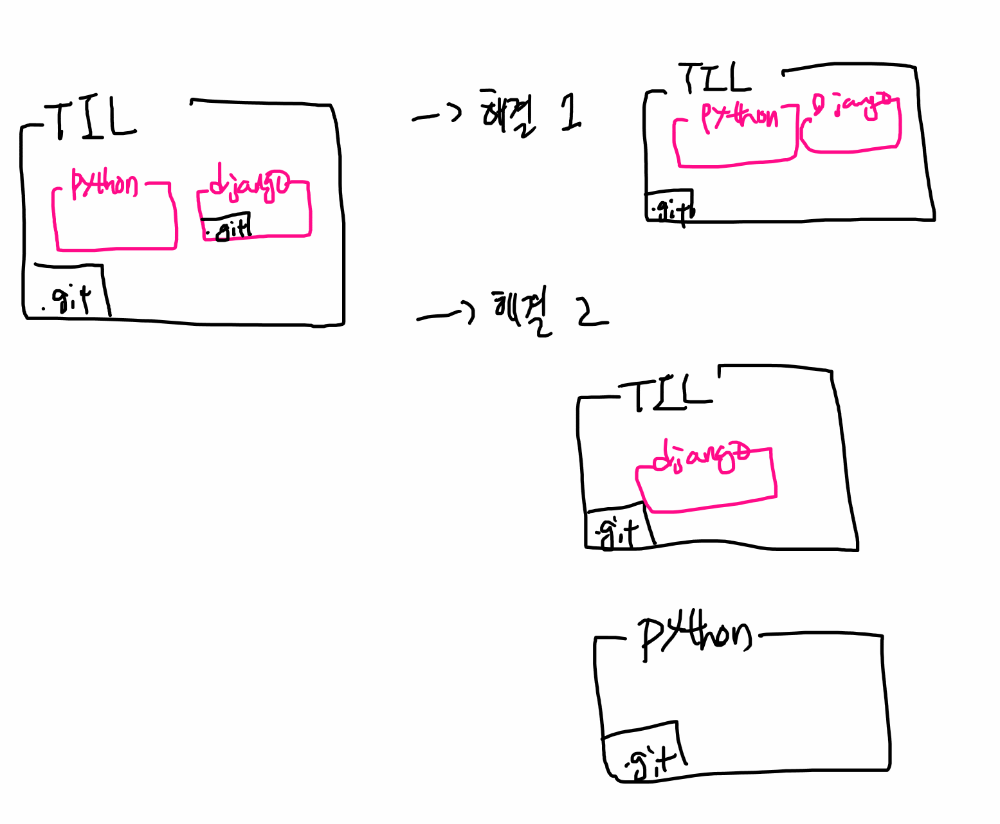

## 자주 하는 실수 모음

### 1. submodule => git 속의 git

<<<<<<< HEAD
=======
> git init은 반드시 폴더의 '최상단!!!!!!'에서만 진행한다!!!!


>>>>>>> 98e0f5a6c329810aa9b2a6cc8bad864aecd5f689
가끔 Github에 폴더에 화살표가 있을 때

* => Git 저장소 내부에 Git 저장소가 있는 경우  

솔루션

- submodule 형식으로 활용할 수는 있지만, 처음에는 복잡하게 가지말자!


### 해결책

1. 최상단에서 하나로 관리
   - django 폴더의 `.git` 폴더를 삭제 

2. django 폴더만 떼서 관리


정리하면 아래와 같음




### 약속

<<<<<<< HEAD
- git 명령어는 항상 .git 폴더가 있는 곳에서 하자!
=======
- git init 항상 git으로 관리하고자 하는 최상단 폴더에서 한번만 하자!!
>>>>>>> 98e0f5a6c329810aa9b2a6cc8bad864aecd5f689
- git 저장소로 활용되는 폴더에 다른 git 저장소를 옮기지 말자!


## 2. TIL 폴더명 변경 가능?

- 바꿔도 됨! 전혀 상관없음

* 폴더 이동도 자유롭게 해도 되지만, 항상 이동할 때 해당 폴더가 다른 git 저장소인지 체크는 할 필요가 있다!

* 프로젝트 폴더 이름이 바뀌는 것은 커밋과 상관이 없다.

```
위에서 테스트 한 원격 저장소 폴더 이름을 submodule_change_folder로 변경하고 추가 작업후 push 해보자
```


## 3. 원격 저장소 이름과 로컬 폴더의 이름이 같아야 하는가?

- 원격 저장소 이름이랑 로컬 폴더 이름은 전혀 상관이 없습니다.

- 그러면 상관이 있는 것은 무엇일까요?

  ```bash
  $ git remote -v # 원격 저장소 정보 조회 
  ```

- 그리고 정보만 기록되어 있어서 `clone` `pull` `push` 등의 명령어를 입력할 때 활용되는 것이지, sync가 되어 있는 것은 아니다!

```
위에서 테스트 한 내용과 사실상 이어짐
```


## 4. 로컬에서 commit을 하면 원격 저장소(Github)에도 자동으로 반영된다.

- Nope! 절대로 동기화 시스템이라고 생각하면 안됨!

- 반드시 push라는 작업이 필요!


## 5. commit이 없는 상태에서 push 하려는 경우

* 커밋이 없어서 push할 수가 없음. 혹은 브랜치가 없다.
* remote 설정은 되어 있는 것을 확인할 수 있음.

``` bash
# no_commit 폴더 생성
$ git init
Initialized empty Git repository in C:/Users/wotjr/Desktop/no_commit/.git/

# 원격 저장소 생성 후 remote 등록
$ git remote add origin https://github.com/edujustin-hphk/no_commit.git

# push 에러
$ git push origin master
error: src refspec master does not match any
error: failed to push some refs to 'https://github.com/edujustin-hphk/no_commit.git'
<<<<<<< HEAD
```
=======
```


### 추가적으로 branch를 사용하기 위해서는 master branch에 최소 1개의 커밋은 있어야 한다.

>>>>>>> 98e0f5a6c329810aa9b2a6cc8bad864aecd5f689
