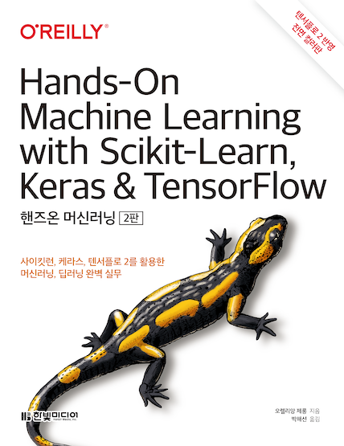

핸즈온 머신러닝 주피터 노트북
==========================

파이썬을 사용해 머신러닝을 공부하는데 도움이 되기 위해 이 저장소를 만들었습니다. 여기에는 한빛미디어의 핸즈온 머신러닝 2판의 예제 코드와 연습문제 답도 포함되어 있습니다.

이 책은 서점에서 판매 중입니다. [Yes24](http://www.yes24.com/Product/Goods/89959711), [교보문고](http://www.kyobobook.co.kr/product/detailViewKor.laf?ejkGb=KOR&mallGb=KOR&barcode=9791162242964), [알라딘](https://www.aladin.co.kr/shop/wproduct.aspx?ItemId=237677114), [한빛미디어](http://www.hanbit.co.kr/store/books/look.php?p_code=B7033438574)

**노트**: 1판의 노트북을 찾고 있다면 [rickiepark/handson-ml](https://github.com/rickiepark/handson-ml)을 참고하세요.

## 동영상 강의

이 책의 동영상 강의를 [유튜브](http://bit.ly/homl2-youtube)와 [인프런](https://www.inflearn.com/course/%ED%95%B8%EC%A6%88%EC%98%A8-%EB%A8%B8%EC%8B%A0%EB%9F%AC%EB%8B%9D)에서 볼 수 있습니다. 혼자 공부하시는 분들에게 도움이 되면 좋겠습니다. :-)

## 시작하기

### 아무것도 설치하지 않고 노트북을 실행하고 싶나요?

다음 서비스 중 하나를 사용하세요.

**경고**: 이런 서비스들은 임시 환경을 제공합니다. 실행이 끝난 후 시간이 지나면 모두 사라집니다. 필요하다면 다운로드해서 보관하세요.

* **추천 옵션**: 구글 [코랩](https://colab.research.google.com/github/rickiepark/handson-ml2/blob/master/)(Colab):
을 사용합니다.

* 또는 [바인더](https://mybinder.org/v2/gh/rickiepark/handson-ml2/master)(Binder):
를 사용합니다.

  * _노트_: 대부분의 경우 바인더가 빠르게 잘 실행되지만 이 깃허브가 업데이트되면 바인더가 처음부터 새로운 환경을 만들어야 하기 때문에 시간이 좀 걸립니다.

* 또는 [딥노트](https://beta.deepnote.com/launch?template=data-science&url=https%3A//github.com/rickiepark/handson-ml2/blob/master/index.ipynb)(Deepnote):

### 코드를 실행하지 않고 노트북을 간단히 둘러 보고 싶나요?

[주피터 노트북 뷰어](https://nbviewer.jupyter.org/github/rickiepark/handson-ml2/blob/master/index.ipynb):
로 이 저장소의 노트북을 볼 수 있습니다.

_노트_: [깃허브의 노트북 뷰어](index.ipynb)를 사용할 수도 있지만 느리고 수학 공식을 완전하게 표시하지 못합니다.

### 도커 이미지를 사용해 실행하고 싶나요?

[도커 가이드](https://github.com/rickiepark/handson-ml2/tree/master/docker)를 참고하세요.

### 자신의 컴퓨터에서 실행하고 싶나요?

먼저 [아나콘다](https://www.anaconda.com/distribution/)(Anaconda) (또는 [미니콘다](https://docs.conda.io/en/latest/miniconda.html)(Miniconda)), [깃](https://git-scm.com/downloads)을 설치하세요. 텐서플로와 호환되는 GPU를 가지고 있다면 [GPU 드라이버](https://www.nvidia.com/Download/index.aspx)와 알맞은 버전의 CUDA와 cuDNN을 설치하세요(자세한 내용은 텐서플로 문서를 참고하세요).

그다음 터미널에서 다음 명령을 실행하여 이 저장소를 클론하세요(`$` 기호는 입력하지 마세요. 이 기호는 터미널 명령이라는 것을 표시하는 것 뿐입니다):

    $ git clone https://github.com/rickiepark/handson-ml2.git
    $ cd handson-ml2

그다음 다음 명령을 실행합니다:

    $ conda env create -f environment.yml # 윈도우일 경우 environment-windows.yml
    $ conda activate homl2 # 윈도우일 경우 conda activate tf2
    $ python -m ipykernel install --user --name=python3

이제 주피터를 시작합니다:

    $ jupyter notebook

더 자세한 내용은 [설치 가이드](INSTALL.md)를 참고하세요.

## 자주하는 질문

**어떤 파이썬 버전을 사용해야 하나요?**

파이썬 3.7을 추천합니다. 위에 소개한 설치 안내를 따랐다면 파이썬 3.7이 설치되었을 것입니다. 파이썬 3의 다른 버전도 대부분 사용할 수 있지만 일부 라이브러리는 파이썬 3.8이나 3.9를 지원하지 않습니다. 그래서 파이썬 3.7을 권장합니다.

**`load_housing_data()`를 호출할 때 에러가 발생합니다**

`load_housing_data()`를 호출하기 전에 `fetch_housing_data()`를 호출했는지 확인하세요. HTTP 에러가 발생한다면 작성한 코드가 노트북에 있는 코드와 동일한지 확인하세요(복사해서 붙여넣기해 보세요). 문제가 계속된다면 네트워크 설정을 확인하는 것이 좋습니다.

**MacOSX에서 SSL 에러가 발생합니다**

아마 SSL 인증을 설치해야 합니다([스택오버플로우 질문](https://stackoverflow.com/questions/27835619/urllib-and-ssl-certificate-verify-failed-error)을 참고하세요). 공식 웹사이트에서 파이썬을 다운로드했다면 터미널에서 `/Applications/Python\ 3.7/Install\ Certificates.command`을 실행하세요(설치된 버전이 다르면 `3.7`을 바꿔 주세요). MacPorts로 파이썬을 설치했다면 터미널에서 `sudo port install curl-ca-bundle`를 실행하세요.

**이 프로젝트를 로컬에 설치했습니다. 어떻게 최신 버전으로 업데이트하나요?**

[INSTALL.md](INSTALL.md) 문서를 참고하세요.

**아나콘다를 사용할 때 어떻게 파이썬 라이브러리를 최신 버전으로 업데이트하나요?**

[INSTALL.md](INSTALL.md) 문서를 참고하세요.

## 기여자

유용한 피드백을 전달해 주고 이슈를 등록하고 RP을 보내준 모든 분들께 감사합니다. 특별히 일부 연습문제의 답을 도와준 [Haesun Park(박해선)](https://tensorflow.blog/about/)에게 감사합니다. 또 `docker` 디렉토리를 만들어준 Steven Bunkley와 Ziembla에게 감사합니다. 연습문제 답을 도와준 깃허브 유저 SuperYorio에게도 감사합니다.
