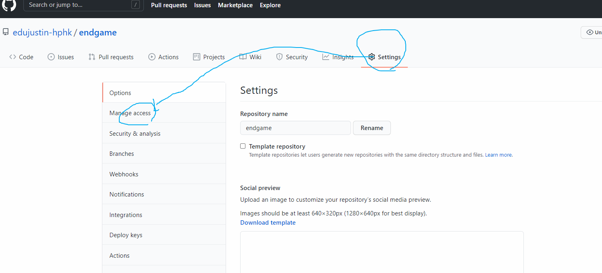
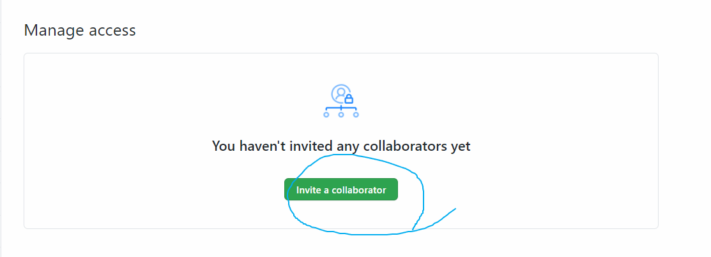
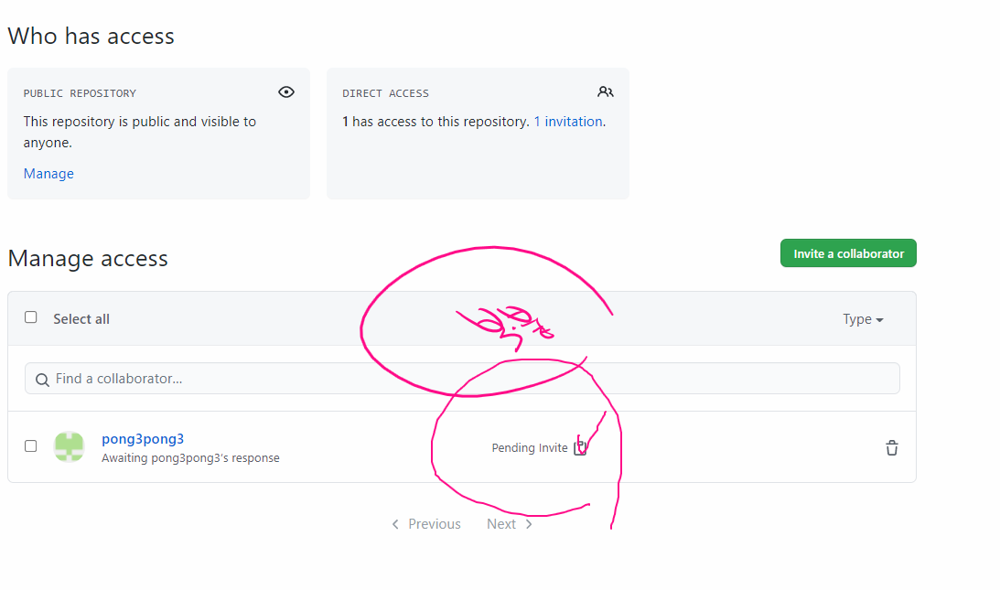

## 실습 1

### Git 저장소 만들고 첫 번째 커밋 남겨보기

- `practice1`이라는 폴더를 바탕화면에 만들고
- git으로 관리하기 위한 초기화 작업을 진행하고
- `a.txt`라는 파일을 만든 다음에
- 첫 번째 commit 남겨보기!

## 실습 2

### 원격 저장소에 `README.md` 파일 push하기 

> 만약 어제 TIL로 작업 완료하신 분들은 새롭게 폴더 만들어서 push까지 진행해보세요!

- TIL 폴더를 만든다. 

- TIL 폴더에 `README.md`  파일 생성 후 어떻게 하루 1개의 commit을 남길 것인지 작성한다.(다짐)
- add, commit을 진행한다. 
- 원격 저장소(remote)를 등록하고 push한다.
- 원격 저장소에 README.md 파일이 잘 나오는지 확인한다.

## 실습 3 - pair

### 끝말잇기

- 팀장

  - 바탕 화면에 폴더 생성

  - README.md 파일 생성 후 끝말잇기를 시작 할 단어를 작성한다.

  - git 초기화 & add, commit

  - 원격 저장소 생성(repo 이름은 `endgame`으로 생성) 후 push

  - 권한 부여

    

  

  

  - 초대장 전송 

    

- 조원 

  - 조장이 보낸 초대장 받고 해당 repo URL clone 
  - 조장이 작성한 제시어 **바로 밑에** 다음 제시어 진행
  - add, commit, push

- 조장

  - git pull origin master
  - 조원이 작성한 제시어 바로 밑에 다음 제시어 진행
  - add, commit, push

  

## 실습 4 - pair

## 실습 5 - pair

